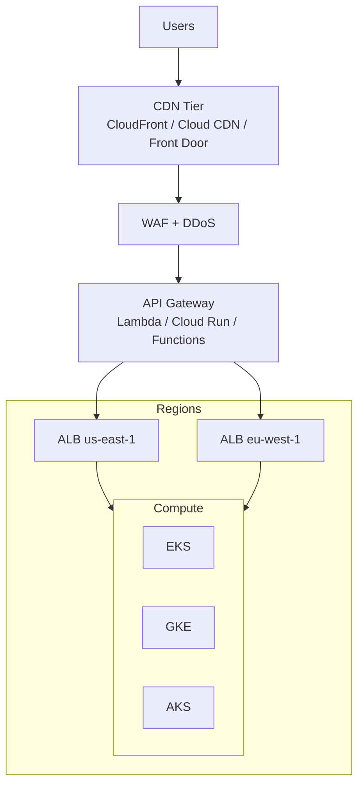
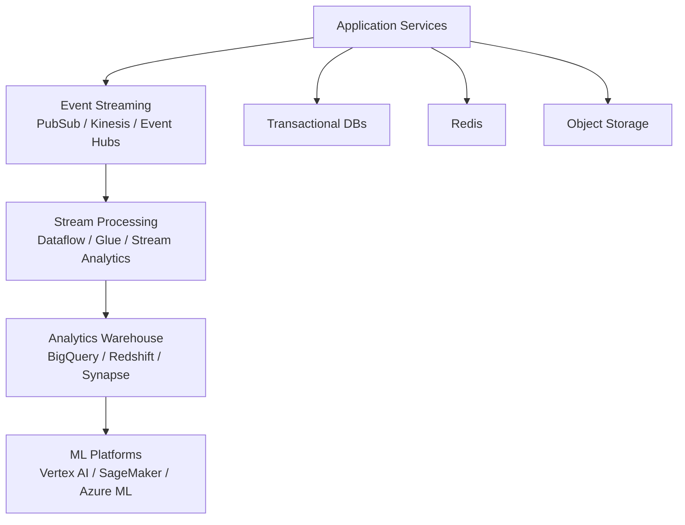
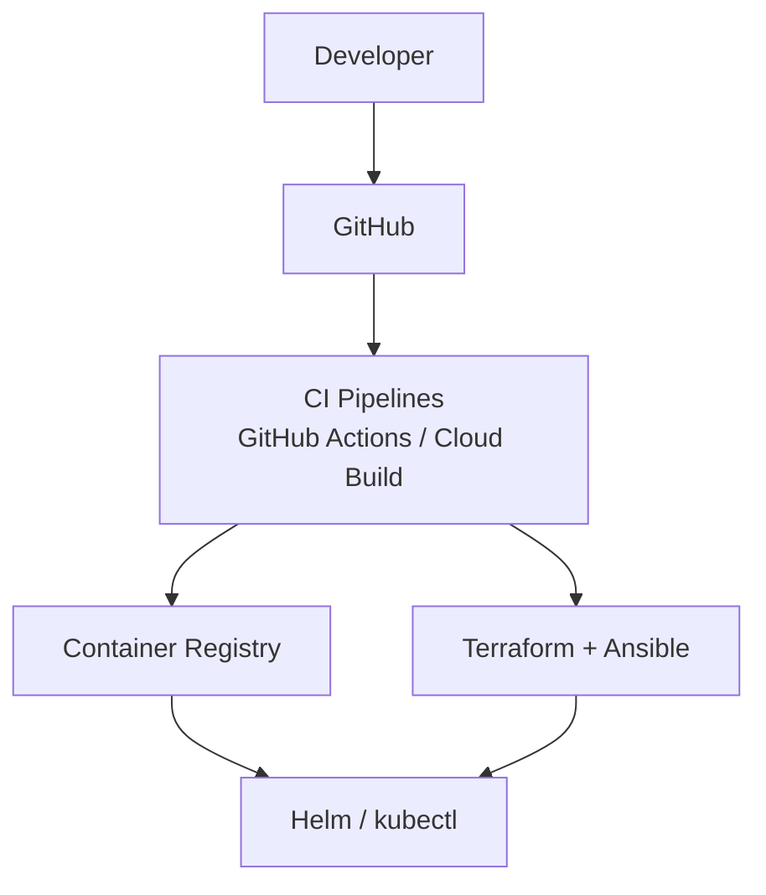
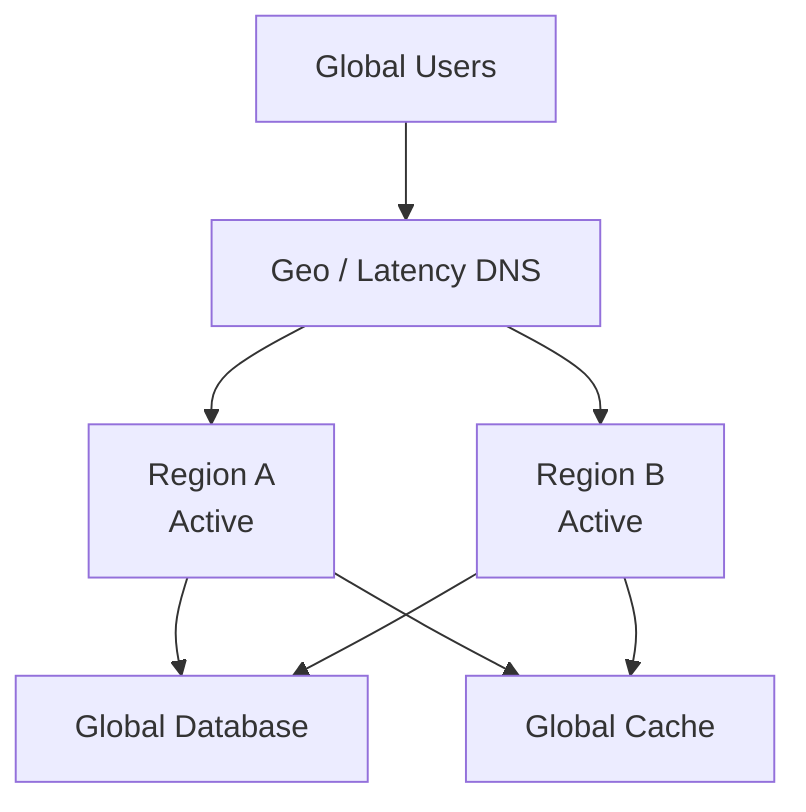

# 🌐 Cloud-Native Streaming Platform & 🌍 Production-Hardened

**Unified Multi-Cloud + AWS Global Architecture Blueprint**

> Enterprise-grade, Netflix-style reference architecture  
> Built for **global scale, real-time workloads, security, resilience, and compliance**

---

## 🚀 Executive Overview

This repository delivers a **complete production architecture** that combines:

- **Multi-Cloud Streaming Platform** (AWS, GCP, Azure)
- **Production-Hardened AWS Global Platform** (Netflix-style multi-region)

It is designed for teams that **expect failure**, operate under **compliance constraints**, and require **zero-downtime delivery**.

---

## 🧱 Architecture Views (Separated by Concern)

This repository provides **four distinct architecture views**:

1. **Runtime Architecture**
2. **Data & Analytics Architecture**
3. **CI/CD & IaC Architecture**
4. **Active-Active Global Traffic Architecture**

Each diagram renders natively in GitHub using Mermaid.

---

# 🟦 1. Runtime Architecture (Request Path)



**Purpose**
- Tier-0 global entry
- Tier-1 regional isolation
- Tier-2 service routing

---

# 🟩 2. Data & Analytics Architecture



**Purpose**
- Real-time analytics
- Cost-efficient batch + streaming
- ML-driven personalization

---

# 🟨 3. CI/CD & Infrastructure Automation



**Purpose**
- Full GitOps workflow
- Immutable deployments
- Automated rollback

---

# 🟥 4. Active-Active Global Traffic (Optional)



**Use When**
- Latency-sensitive apps
- Read-heavy workloads
- Global user base

---

## 🧪 Chaos Engineering (All Layers)

| Failure Type | Injection |
|-------------|-----------|
| Pod failure | Kill pods |
| AZ outage | Disable subnets |
| Region failure | DNS failover |
| DB failure | Forced failover |
| Latency | AWS FIS |

---

## 📊 Compliance Mapping

| Control Area | SOC2 | ISO 27001 | PCI-DSS |
|-------------|------|-----------|---------|
| IAM & Access Control | ✔ | ✔ | ✔ |
| Encryption at Rest | ✔ | ✔ | ✔ |
| Encryption in Transit | ✔ | ✔ | ✔ |
| Logging & Monitoring | ✔ | ✔ | ✔ |
| Change Management | ✔ | ✔ | ✔ |
| Backup & DR | ✔ | ✔ | ✔ |
| Network Segmentation | ✔ | ✔ | ✔ |

**Notes**
- Uses cloud-native controls
- Audit-ready logging
- Least-privilege IAM everywhere

---

## 🖼️ PNG / SVG Diagram Exports

All diagrams can be exported using:
- Mermaid Live Editor
- VS Code Mermaid plugin
- CI pipeline diagram export

**Recommended**
- Export SVG for documentation
- Export PNG for presentations

---

## 💰 FinOps & Cost Optimization

- Spot / preemptible compute
- Autoscaling everywhere
- Storage tiering
- Idle resource cleanup
- Budget alerts

Typical savings: **30–70%**

---

## 📁 Repository Structure

```text
repo/
├─ frontend/
├─ backend/
├─ infrastructure/
│  ├─ terraform/
│  ├─ kubernetes/
│  ├─ ansible/
│  └─ ci-cd/
├─ data/
├─ docs/
└─ README.md
```

---

## 💼 Credits

**Architecture & Platform Design**  
Ankur Chouhan — Alien LLC / YFS Entertainment

📧 ankurchouhan@yfsentertainment.com  
🌐 https://www.yfsentertainment.com

---

## ⚖️ License

MIT License © 2025 Ankur Chouhan / Alien LLC
